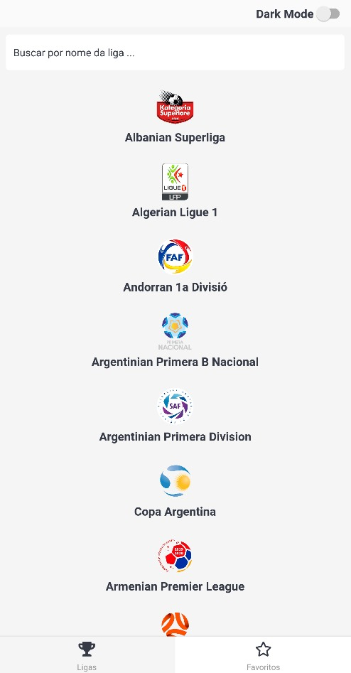
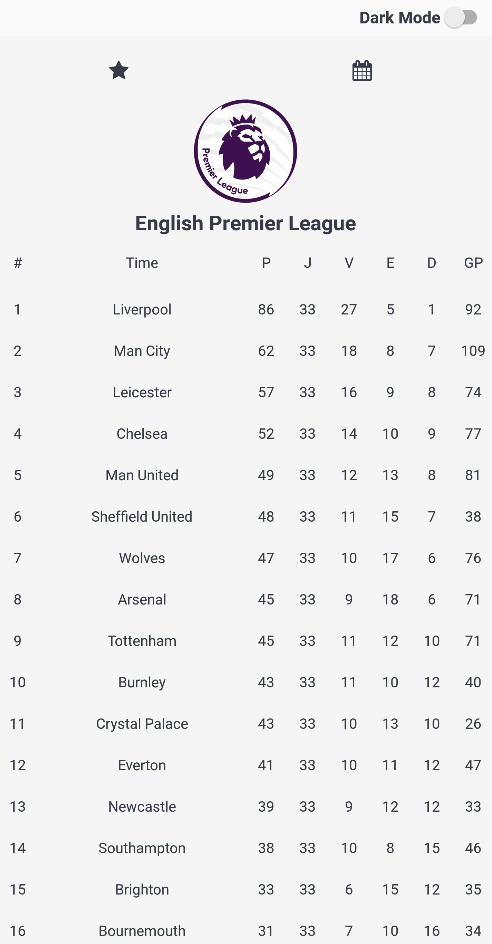
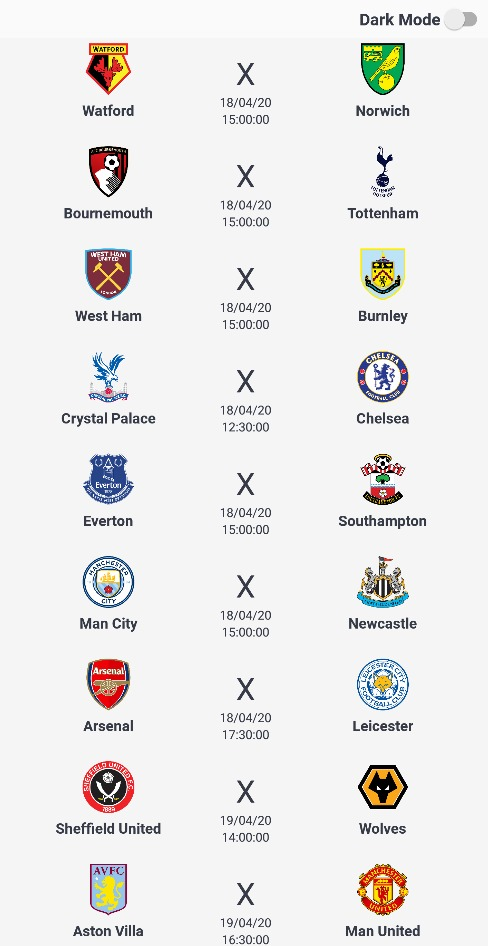
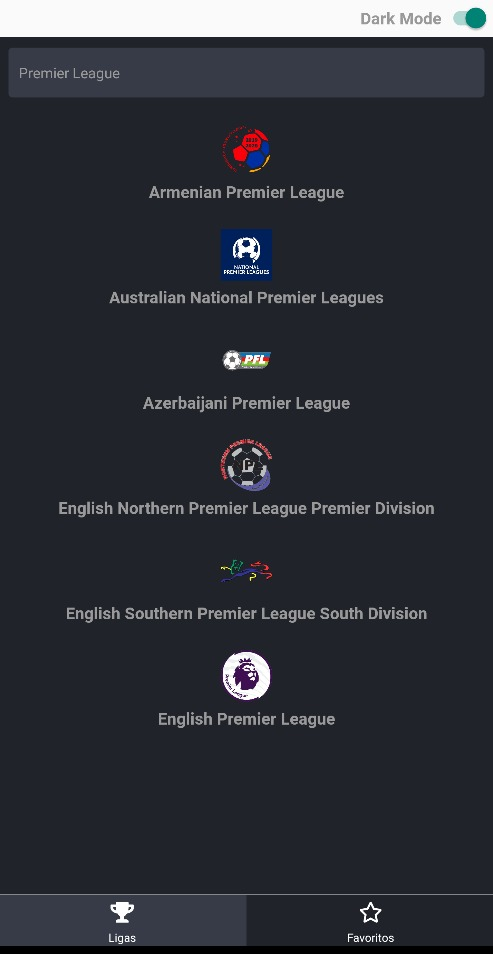
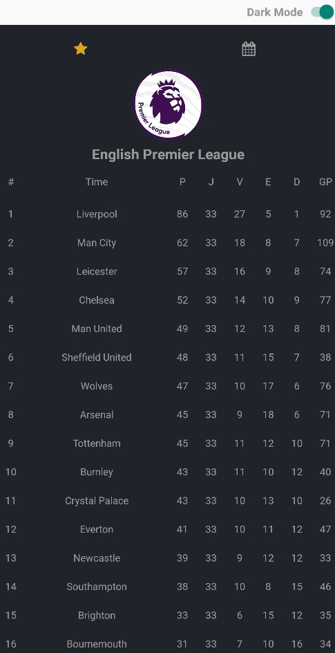
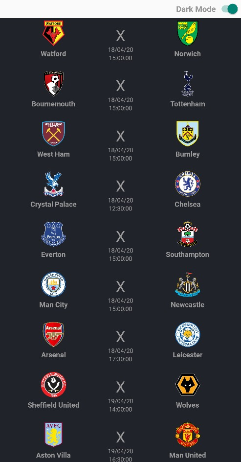

<h3 align="center">

</h3>
<h1 align="center">
  TabelaFC
</h1>

Application for viewing football tables and matches.</blockquote>

  

  

  

  

| | | |
|:-------------------------:|:-------------------------:|:-------------------------:|
|  Home |  League Detail| League Matches
| | |

| | | |
|:-------------------------:|:-------------------------:|:-------------------------:|
|  Home |  League Detail| League Matches
| | |

## Application Proposal

This application is intended to assist in queries on results of football matches and their respective results and ranking tables

## Techs

 - [React Native](https://reactnative.dev/)
 - [React Navigation](https://reactnavigation.org/)
 - [Axios](https://www.npmjs.com/package/axios)
 - [Polished](https://www.npmjs.com/package/polished)
 - [PropTypes](https://www.npmjs.com/package/prop-types)
 - [React Native Table Component](https://www.npmjs.com/package/react-native-table-component) 
 - [React Vector Icons](https://www.npmjs.com/package/react-native-vector-icons)
 - [Styled Components](https://www.npmjs.com/package/styled-components)

## How to Run

### All my tests were done using cell phones with android operating systems. If you want to use the IOS operating system, you will need to make some extra settings regarding the dependency libs.

To install project dependencies

### `yarn or npm install`

Init the react native app

### `npx react-native start`

Run app on Device/Emulator

### `npx react-native run-android`

Feito com 💜 by kaiomagri :wave: